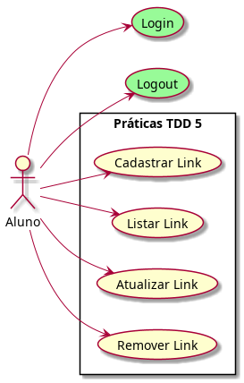
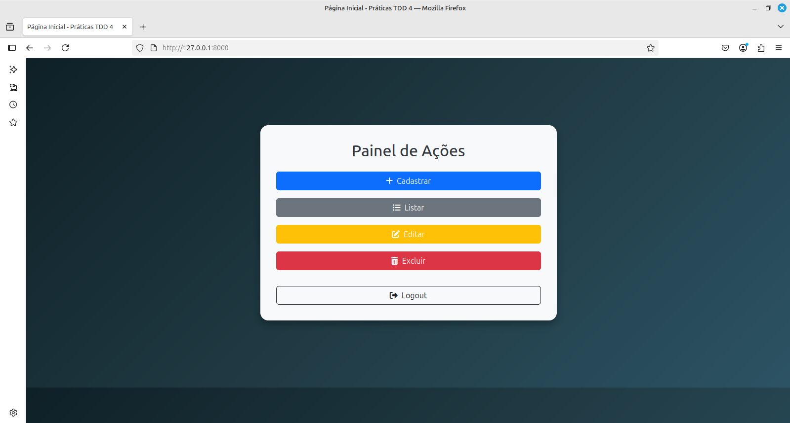
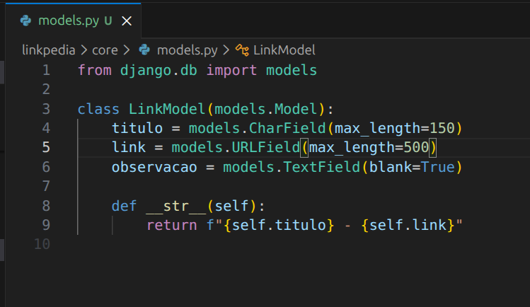
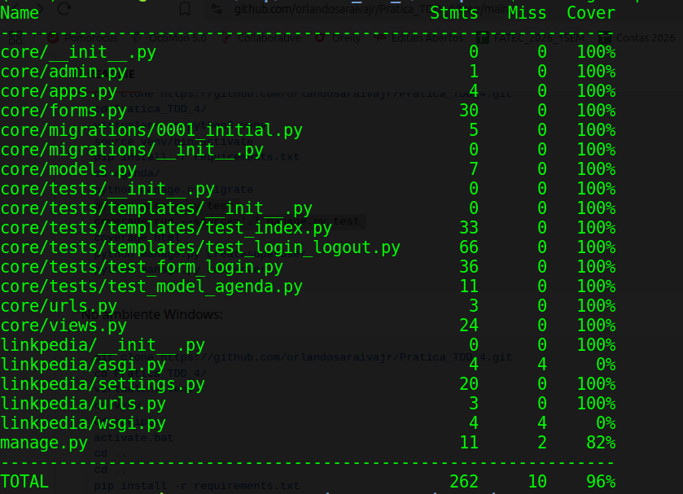
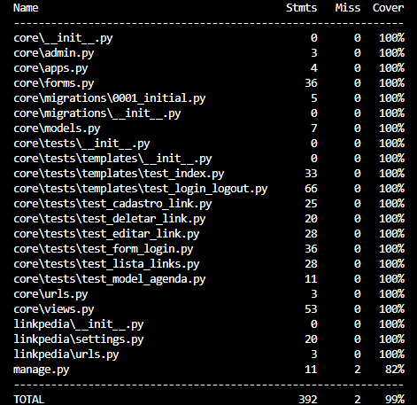

# Prática TDD 5

Desafio técnico para os alunos da disciplina "Desenvolvimento Web 3"


No ambiente Linux:

```console
git clone https://github.com/orlandosaraivajr/Pratica_TDD_5.git
cd Pratica_TDD_5/
virtualenv -p python3 venv
source venv/bin/activate
pip install -r requirements.txt
cd linkpedia/
python manage.py migrate
python manage.py test
coverage run --source='.' manage.py test 
coverage html
python manage.py createsuperuser
python manage.py runserver
```

No ambiente Windows:

```console
git clone https://github.com/orlandosaraivajr/Pratica_TDD_5.git
cd Pratica_TDD_5/
virtualenv venv
cd venv
cd scripts
activate.bat
cd ..
cd ..
pip install -r requirements.txt
cd linkpedia/
python manage.py migrate
python manage.py test
coverage run --source='.' manage.py test 
coverage html
python manage.py createsuperuser
python manage.py runserver

```


Crie um superusuário com as seguintes credenciais:

- Username <b>aluno</b>:
- E-mail address: <b>seu e-mail institucional</b>
- Password: <b>fatec</b>

### Requisitos da Sprint 1



A expectativa do projeto é que tenha-se um cadastro de links. O que foi priorizado na primeira sprint foi o sistema de login/logout.
O login somente pode ocorrer com o e-mail institucional @cps.sp.gov.br 


Imagem 1: Tela de Login



Imagem 2: Tela index


Imagem 3: Tela logout

## Requisitos para a Sprint 2

Agora começa o seu desafio: desenvolver um cadastro de links com as operações de CRUD.

Com base no modelo implementado (ver imagem abaixo), você deve:



✅ Criar um formulário para o modelo LinkModel (pode usar Forms ou ModelForms);

Implementar as seguintes funcionalidades:

✅ Cadastrar contato

✅ Listar contatos

✅ Atualizar contato

✅ Remover contato

Proteger todas essas funcionalidades para que apenas usuários logados tenham acesso.

Ao final da Sprint 2, o sistema deverá conter um CRUD funcional de links em Django.

Sprint 2: CRUD de Links (Concluída)

Nesta etapa, o desafio de desenvolver o cadastro de links com as operações completas de CRUD foi finalizado com sucesso, aplicando padronização visual e boas práticas do framework Django.
Funcionalidades Implementadas:


    Formulários (ModelForms): Uso do arquivo forms.py para validação robusta e reaproveitamento de código tanto no Cadastro quanto na Edição.

    Create (Cadastro): Tela de inserção de novos links com tratamento de erros nativo do Django.

    Read (Listagem): Tabela dinâmica exibindo todos os links cadastrados.

    Update (Edição): Tela dedicada para atualizar informações recuperando os dados existentes.

    Delete (Remoção): Exclusão segura de registros.

    Segurança: Acesso restrito a usuários autenticados nas funcionalidades do sistema.

    Interface (UI/UX): Design responsivo e moderno padronizado em todas as telas utilizando Bootstrap 5 (Dark Theme) e Bootstrap Icons.


## Ajustes nos testes / novos testes

O código fonte passará por atualizações para acomodar estes novos requisitos. Com isso, você deve ajudar os testes existentes e criar novos testes.

Você recebeu a sprint 1 com uma cobertura de teste acima de 90%. É esperado que ao final da sprint 2 a cobertura mantenha-se neste patamar.



### Testes (TDD) e Cobertura

O código fonte foi desenvolvido seguindo a metodologia TDD (Test-Driven Development). Para acomodar as operações de CRUD criadas na Sprint 2, novos casos de testes automatizados foram construídos.
O que foi testado:

    Models: Persistência no banco de dados e formatação do método __str__.

    Views e Rotas: Verificação de respostas HTTP (Status 200 para GET e 302 para POST com redirect).

    Templates e Contexto: Validação das variáveis enviadas da View para o HTML (response.context).

    Autenticação e Segurança: Verificação do bloqueio de acesso a usuários anônimos (@login_required) e simulação de sessões autenticadas nos testes (force_login).

    Proteção de Exceções: Teste de retornos 404 (get_object_or_404) na tentativa de edição ou exclusão de IDs inexistentes.

Foi mantido e superado o patamar de excelência exigido na Sprint 1. Abaixo está o relatório comprovando a  cobertura dos testes no projeto:

Imagem: Cobertura atualizada de Testes do Projeto


